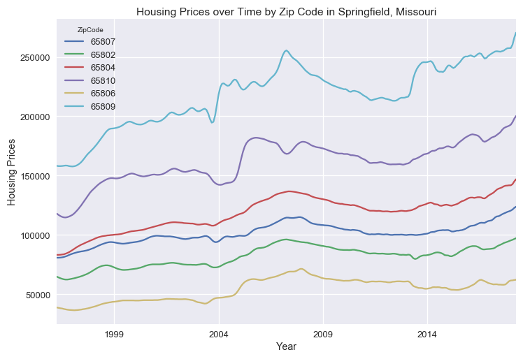
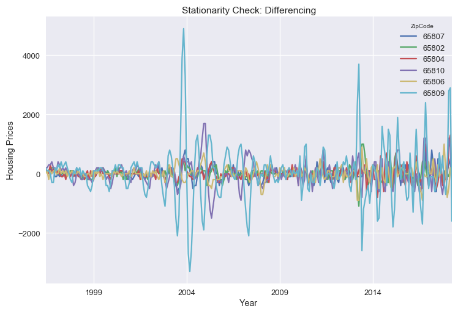
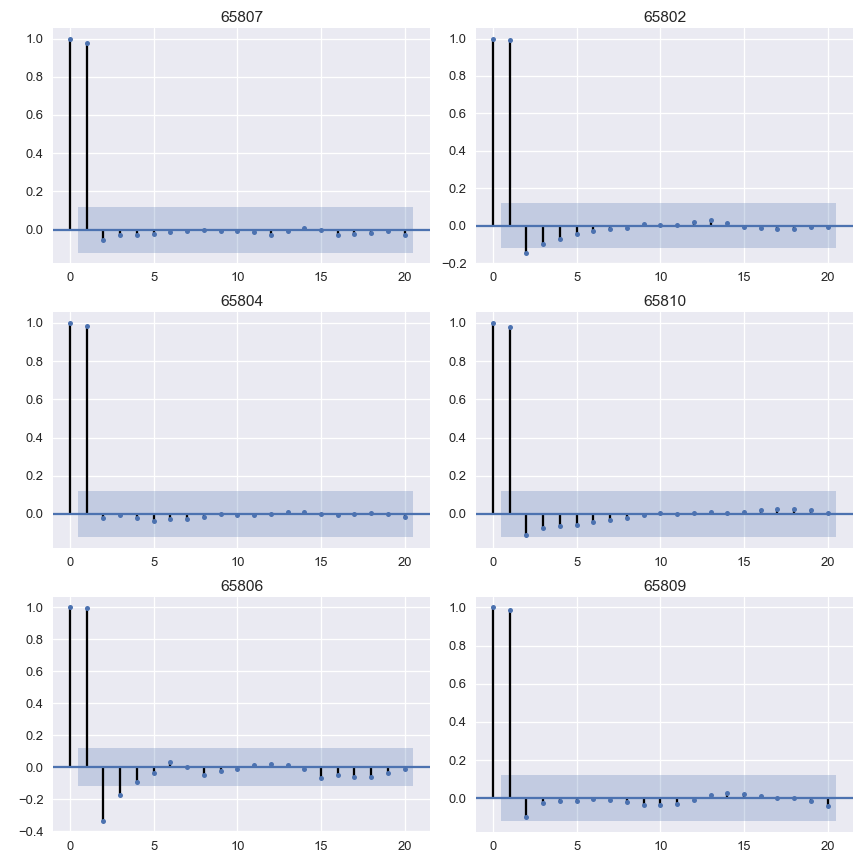

# Time Series Analysis of Housing Prices in Springfield, Missouri

### Members
* Taejoon Kim
* Andrew Muller
* Deric Williamson

## Business Case
Our aim is to investigate the prices for housing in zip codes in the area of Springfield, Missouri. We will model these prices using various time series modeling techniques and determine which zip codes present the best opportunity for investment.

## Exploratory Data Analysis
todo

## Modeling
todo

## Analysis
todo

## Conclusions
todo

## Future Work
todo
