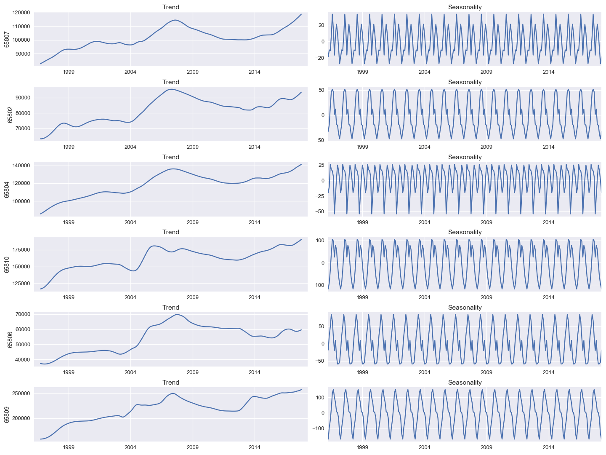
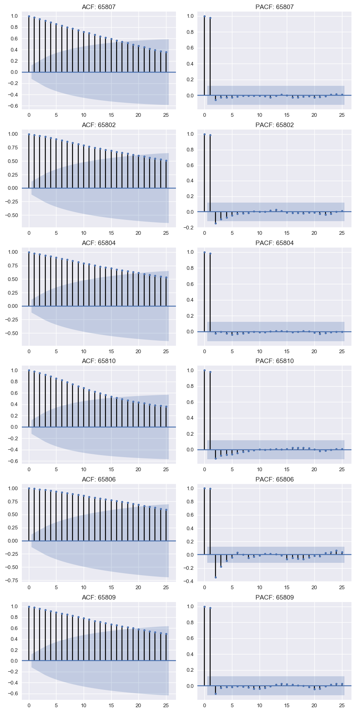
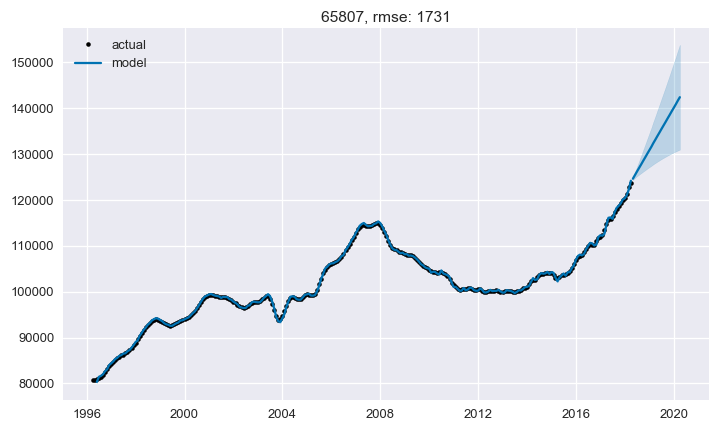
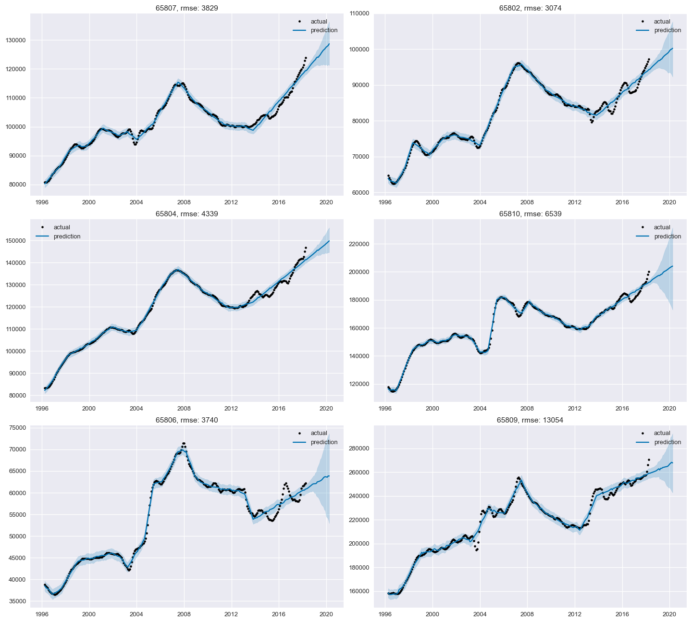

# Time Series Analysis of Housing Prices in Springfield, Missouri

### Members
* Andrew Muller
* Deric Williamson

## Business Case

As Data Scientists working for a home renovation company, we were given the task to investigate and predict the average housing prices in the next two years using various zip codes in Springfield, MO. Using data from 1996 to 2018, we will use various time series models to determine which zip code would be the best investment to buy houses in to renovate.

## Exploratory Data Analysis

Analyzing 15,000 different zip codes isn't very feasible, so after looking at the data we have decided to focus on the six zip codes in one city: Springfield, Missouri. Since we are only interested in analyzing the trends over time, we will remove the unecessary columns from our dataset. In order to run models on this data, we need to convert the string dates into datetime objects. We also need to convert our dataframe from wide format to long format.

Here we use matplotlib to visualize our data and get a general idea of it. Our checks for stationarity reveal that our models are not at all stationary. However, this will be taken care of inside our ARIMA models.

Results of Dickey-Fuller test (want p-value < 0.05)
 - 65807: 0.788008
 - 65802: 0.233519
 - 65804: 0.391874
 - 65810: 0.081698
 - 65806: 0.211948
 - 65809: 0.133164

The scale of our seasonality is ±$100, even in the worst case. Considering we are talking about housing prices in the hundreds of thousands, this accounts for ~0.1% of our values. We can safely disregard all seasonality concerns.

## ARIMA Models

Autocorrelation (ACF) helps us study how each time series observations is related to the past. Partial Autocorrelation (PACF) gives us a correlation of a time series with its own lagged values, controlling forthe values of the time series at all shorter lags. These charts will help us determine the starting orders in a ARMA model.

The baseline models use ARIMA and the (1, 2, 0) order as determined by our ACF and PACF analysis.

cross-validated RMSE values:
- 65807: 2042
- 65802: 3416
- 65804: 2661
- 65810: 4826
- 65806: 3368
- 65809: 11553

The final models use ARIMA with a different order for each model, as determined by the omdarima.auto_arima function. All RMSE values lower than their baselines. Despite the low rmse values, these charts show how closely fit to the data the predictions are, which may indicate overfitting. Based on a cursory look at the charts, the 65804 zip code seems to have the sharpest incline in its forecast, indicating a good investment opportunity.

orders and cross-validated RMSE values:
- 65807: (2, 2, 1), 1731
- 65802: (0, 2, 1), 3342
- 65804: (1, 2, 2), 2229
- 65810: (2, 2, 2), 4222
- 65806: (0, 2, 1), 3073
- 65809: (1, 2, 0), 11553

## Facebook Prophet

The same data was run on Facebook Prophet models. The baseline models use default parameters.

cross-validated RMSE values:
- 65807: 4054
- 65802: 3295
- 65804: 4492
- 65810: 7879
- 65806: 3781
- 65809: 14392

After hyperparameter tuning, we came up with better models for each zip code. These models have lower RMSE values than their ARIMA equivalents, but appear less prone to overfitting and have narrower confidence intervals on the forecasts.

cross-validated RMSE values:
- 65807: 3829
- 65802: 3074
- 65804: 4339
- 65810: 6539
- 65806: 3740
- 65809: 13054

## Analysis

The model for each zip code was chosen base on RMSE. The ARIMA models performed better than the Prophet models for every zip code except 65802.

Zip Code | ARIMA RMSE | Prophet RMSE | Best Model
:-- | :-- | :-- | :--
65807	| 1731	| 3829	| ARIMA
65802	| 3342	| 3074	| Prophet
65804	| 2229	| 4339	| ARIMA
65810	| 4222	| 6539	| ARIMA
65806	| 3073	| 3740	| ARIMA
65809	| 11553 |	13054	| ARIMA

Choosing the correct model for each zip code, we get the following results:
- 65809: 69.41
- 65804: 34.19
- 65807: 22.76
- 65810: 11.8
- 65802: 8.21
- 65806: 4.32

A steep slope indicates a quick rise in value in the future, indicating a good investment. Based on this, zip code 65809 would be a good investment. However, the RMSE values for that zip code's model are much higher than the others, possibly indicating a poorer accuracy forecast or more volatility. Instead, the second steepest slope, zip code 65804, should be chosen as the top investment opportunity.

## Conclusions

Based on the models, we have concluded that zip code 65804 would be the best zip code for the home renovation company to invest their money in. If focusing in the 65804 area, the company should see the average housing prices continuing to increase over the next two years.

## Future Work

It is important to note that these values are already old. Even our 2-year prediction is already 9 months out of date. As well, the chosen ARIMA models had apparent overfitting issues based on their prediction charts, and larger confidence intervals as well. More work would need to be done before making actual investments based on these models.

More recent data would be needed in order to make this model useful for actual investments. If obtained, it could also be used as a sort of holdout dataset, verifying our current conclusions. We have also chosen a 2-year forecast range arbitrarily. In order to improve our model, we would need to perform an analysis on what range these models are most accurate over, and what time frame is useful in the field of housing investments.
