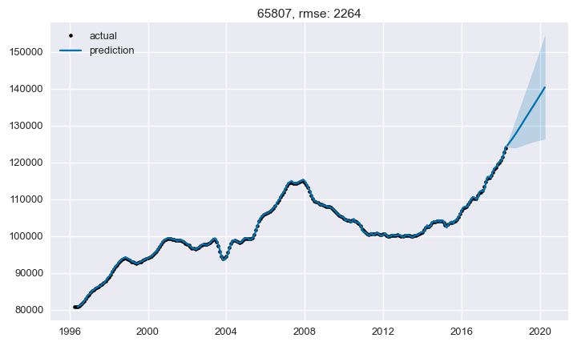

# Time Series Analysis of Housing Prices in Springfield, Missouri

### Members
* Taejoon Kim
* Andrew Muller
* Deric Williamson

## Business Case

As Data Scientists working for a home renovation company, we were given the task to investigate and predict the average housing prices in the next two years using various zip codes in Springfield, MO. Using data from 1996 to 2018, we will use various time series models to determine which zip code would be the best investment to buy houses in to renovate.

## Exploratory Data Analysis

Analyzing 15,000 different zip codes isn't very feasible, so after looking at the data we have decided to focus on the six zip codes in one city: Springfield, Missouri. Since we are only interested in analyzing the trends over time, we will remove the unecessary columns from our dataset. In order to run models on this data, we need to convert the string dates into datetime objects. We also need to convert our dataframe from wide format to long format.

Here we use matplotlib to visualize our data and get a general idea of it. Our checks for stationarity reveal that our models are not at all stationary. However, this will be taken care of inside our ARIMA models.

Results of Dickey-Fuller test (want p-value < 0.05)
 - 65807: 0.788008
 - 65802: 0.233519
 - 65804: 0.391874
 - 65810: 0.081698
 - 65806: 0.211948
 - 65809: 0.133164

The scale of our seasonality is ±$100, even in the worst case. Considering we are talking about housing prices in the hundreds of thousands, this accounts for ~0.1% of our values. We can safely disregard all seasonality concerns.

## ARIMA Models

Autocorrelation (ACF) helps us study how each time series observations is related to the past. Partial Autocorrelation (PACF) gives us a correlation of a time series with its own lagged values, controlling forthe values of the time series at all shorter lags. These charts will help us determine the starting orders in a ARMA model.

The baseline models use ARIMA and the (1, 2, 0) order as determined by our ACF and PACF analysis.

cross-validated RMSE values:
- 65807: 2042
- 65802: 3416
- 65804: 2661
- 65810: 4826
- 65806: 3368
- 65809: 11553

The final models use ARIMA with a different order for each model, as determined by the omdarima.auto_arima function. All RMSE values lower than their baselines. Despite the low rmse values, these charts show how closely fit to the data the predictions are, which may indicate overfitting. Based on a cursory look at the charts, the 65804 zip code seems to have the sharpest incline in its forecast, indicating a good investment opportunity.

orders and cross-validated RMSE values:
- 65807: (2, 2, 1), 1731
- 65802: (0, 2, 1), 3342
- 65804: (1, 2, 2), 2229
- 65810: (2, 2, 2), 4222
- 65806: (0, 2, 1), 3073
- 65809: (1, 2, 0), 11553

## Facebook Prophet

The same data was run on Facebook Prophet models. The baseline models use default parameters.

cross-validated RMSE values:
- 65807: 4054
- 65802: 3295
- 65804: 4492
- 65810: 7879
- 65806: 3781
- 65809: 14392

After hyperparameter tuning, we came up with better models for each zip code. These models have lower RMSE values than their ARIMA equivalents, but appear less prone to overfitting and have narrower confidence intervals on the forecasts.

cross-validated RMSE values:
- 65807: 3829
- 65802: 3074
- 65804: 4339
- 65810: 6539
- 65806: 3740
- 65809: 13054

## Analysis
todo

## Conclusions
todo

## Future Work
todo
